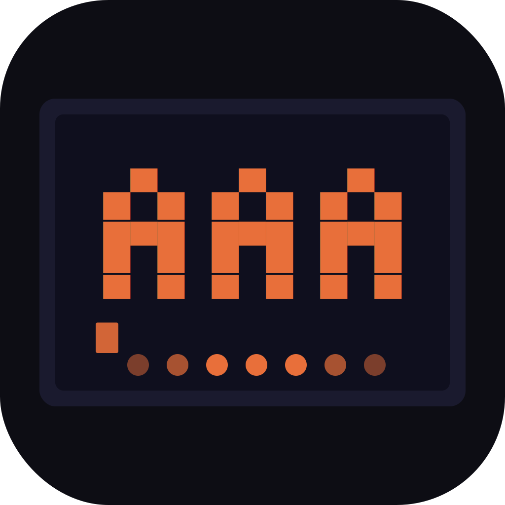

<p align="center">
  
</p>

# ASCII Art Animator

A desktop app for creating ASCII art animations — frame by frame, with a timeline, playback, and export to GIF, ANSI shell script, or self-running Rust binary.

Built with Tauri 2 + React + TypeScript.

---

## Download

Grab the installer for your platform from [Releases](https://github.com/rwetz/ascii-art-animator/releases).

| Platform | File |
|---|---|
| Windows | `.exe` (NSIS) or `.msi` |
| macOS (Apple Silicon) | `.dmg` (aarch64) |
| macOS (Intel) | `.dmg` (x86_64) |
| Linux | `.deb` or `.AppImage` |

---

## Features

- **Monospace grid canvas** — click or drag to place characters
- **Pencil, eraser, and flood-fill tools** — keyboard shortcuts `P` / `E` / `F`
- **Undo / redo** — `Ctrl+Z` / `Ctrl+Shift+Z` (or `Ctrl+Y`), 50-step history
- **Character palette** — pick any ASCII character or type one directly
- **ANSI color picker** — 16 foreground colors per cell
- **Frame timeline** — add, duplicate, delete, and reorder frames
- **Playback** — loop with adjustable FPS
- **Onion skinning** — previous frame ghosted at reduced opacity
- **Export to GIF** — animated GIF rendered in-browser, no server needed
- **Export to ANSI shell script** — self-running `.sh` that plays the animation in a terminal
- **Export to Rust source** — compile with `rustc animation.rs -o anim && ./anim`
- **Save / open projects** — `.aaa` project files (JSON)
- **Welcome screen** — with ASCII mandala art

---

## Building from Source

**Prerequisites:** [Node.js](https://nodejs.org/) (LTS), [pnpm](https://pnpm.io/), [Rust](https://rustup.rs/)

```bash
git clone https://github.com/rwetz/ascii-art-animator.git
cd ascii-art-animator
pnpm install
pnpm tauri dev        # dev server with hot reload
pnpm tauri build      # production build + installer
```

Linux also requires WebKit2GTK:
```bash
sudo apt-get install libwebkit2gtk-4.1-dev libappindicator3-dev librsvg2-dev patchelf
```

---

## Keyboard Shortcuts

| Key | Action |
|---|---|
| `P` | Pencil tool |
| `E` | Eraser tool |
| `F` | Fill tool |
| Any character | Set active character |
| `Ctrl+Z` | Undo |
| `Ctrl+Shift+Z` / `Ctrl+Y` | Redo |
| `Space` | Play / pause |

---

## Project File Format

Projects save as `.aaa` files (plain JSON):

```json
{
  "version": 1,
  "cols": 80,
  "rows": 24,
  "fps": 8,
  "frames": [
    { "id": "...", "cells": [[{ "char": " ", "color": null }]] }
  ]
}
```
